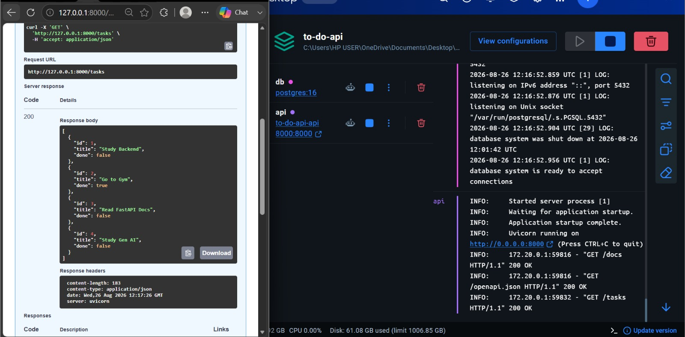

# Task API - Containerized with PostgreSQL

A professional Task Management REST API built with **FastAPI** and **PostgreSQL**, fully containerized using **Docker**.

This project represents the third stage of storage evolution in the FlyRank Backend Track: migrating from local **SQLite** (A2) to a professional **PostgreSQL** database server running in a containerized environment (A3).

---

## Project Description

The Task API provides a complete set of CRUD (Create, Read, Update, Delete) operations.

The main goal of this stage was to ensure the application is portable and works identically on any machine using **Docker Compose**.

Each task contains:

- `id` — unique task identifier (SERIAL primary key)
- `title` — the content of the task
- `done` — completion status (Boolean)

The API uses:

- **FastAPI** for building the RESTful routes
- **PostgreSQL 16** as the database engine
- **Docker** to isolate the application and database
- **Docker Compose** to orchestrate the multi-container stack
- **Psycopg 3** as the modern database driver for Python
- **Pydantic** for request body validation

---

## Project Structure

```text
to-do-api/
│
├── main.py              # FastAPI application and API endpoints
├── database.py          # PostgreSQL connection and CRUD logic
├── Dockerfile           # Build instructions for the API container
├── compose.yaml         # Service orchestration (API + DB)
├── requirements.txt     # Python dependencies
├── .env.example         # Template for environment variables
├── .dockerignore        # Files to exclude from Docker image
├── .gitignore           # Files to exclude from Git
└── README.md            # Project documentation
```

### Files Description

#### `main.py`

The entry point of the application.

It handles:

- API routing
- Request validation using Pydantic models
- HTTP response status codes
- Communication with the database layer

#### `database.py`

Contains the **Repository** logic.

It handles:

- Connecting to the PostgreSQL server
- Reading database credentials from environment variables
- Creating the `tasks` table
- Executing SQL queries
- Performing CRUD database operations
- Using parameterized queries to help prevent SQL injection

#### `Dockerfile`

Contains the instructions required to build the API Docker image.

The project uses:

```text
python:3.10-slim
```

as the base image.

#### `compose.yaml`

Defines the services required to run the application:

- `api` — the FastAPI application
- `db` — the PostgreSQL database

It also manages the PostgreSQL volume used for data persistence.

#### `requirements.txt`

Contains the Python packages required by the application.

#### `.env.example`

Provides a template for the environment variables required by the application.

#### `.dockerignore`

Specifies files and directories that should not be included in the Docker image.

#### `.gitignore`

Specifies files that should not be committed to Git, such as:

- Virtual environments
- Environment files
- Python cache files
- Local development files

---

## Installation & Setup

### 1. Clone the Repository

```bash
git clone https://github.com/Ibrahimhussein711/to-do-api
cd to-do-api
```

### 2. Environment Setup

The project uses environment variables for configuration and security.

Copy the example environment file:

```bash
cp .env.example .env
```

On Windows PowerShell, you can use:

```powershell
Copy-Item .env.example .env
```

The `.env` file contains the configuration required for the FastAPI application to connect to PostgreSQL.

> The `.env` file should not be committed to Git because it may contain sensitive configuration values.

---

## Running the Application

Make sure **Docker Desktop** is running.

Build and start the complete application stack using:

```bash
docker compose up --build
```

This command starts:

- FastAPI application
- PostgreSQL database

The API will be available at:

```text
http://localhost:8000
```

---

## Stopping the Application

To stop the running containers:

```bash
docker compose down
```

The PostgreSQL data remains persisted because the database uses a named Docker volume.

---

## API Documentation

FastAPI automatically provides interactive Swagger documentation.

Once the containers are running, open:

```text
http://localhost:8000/docs
```

Swagger UI can be used to test all API endpoints.

---

## Database

The project uses **PostgreSQL 16** as its database engine.

The PostgreSQL database runs inside a Docker container.

The database data is stored using a named Docker volume so that data persists even when the containers are stopped or recreated.

---

## Database Schema

The `tasks` table contains:

| Column | Type | Description |
|---|---|---|
| `id` | SERIAL | Primary key, auto-incremented |
| `title` | TEXT | Task title |
| `done` | BOOLEAN | Completion status |

The `done` column uses:

```text
false = Task is not completed
true  = Task is completed
```

---

# API Endpoints

## 1. Get All Tasks

### Request

```http
GET /tasks
```

Returns all tasks stored in PostgreSQL.

### Status Code

```text
200 OK
```

### Example Response

```json
[
  {
    "id": 1,
    "title": "Study Backend",
    "done": false
  },
  {
    "id": 2,
    "title": "Go to Gym",
    "done": true
  }
]
```

---

## 2. Get Task By ID

### Request

```http
GET /tasks/{id}
```

### Example

```http
GET /tasks/1
```

### Status Code

```text
200 OK
```

### Example Response

```json
{
  "id": 1,
  "title": "Study Backend",
  "done": false
}
```

If the task does not exist:

```text
404 Not Found
```

Example:

```json
{
  "detail": "Task not found"
}
```

---

## 3. Create a New Task

### Request

```http
POST /tasks
```

### Request Body

```json
{
  "title": "Learn PostgreSQL"
}
```

The `done` value is automatically set to:

```text
false
```

The task ID is generated automatically by PostgreSQL using the `SERIAL` primary key.

### Example Response

```json
{
  "id": 4,
  "title": "Learn PostgreSQL",
  "done": false
}
```

### Status Code

```text
201 Created
```

---

## 4. Update a Task

### Request

```http
PUT /tasks/{id}
```

### Example

```http
PUT /tasks/1
```

### Request Body

```json
{
  "title": "Study PostgreSQL",
  "done": true
}
```

### Example Response

```json
{
  "id": 1,
  "title": "Study PostgreSQL",
  "done": true
}
```

### Status Code

```text
200 OK
```

If the task does not exist:

```text
404 Not Found
```

---

## 5. Delete a Task

### Request

```http
DELETE /tasks/{id}
```

### Example

```http
DELETE /tasks/3
```

### Successful Response

```text
204 No Content
```

There is no response body for a successful delete.

If the task does not exist:

```text
404 Not Found
```

---

# SQL Operations

The application uses **Psycopg 3** to communicate with PostgreSQL.

The SQL queries use parameters instead of directly inserting user input into SQL statements.

### Select All Tasks

```sql
SELECT id, title, done
FROM tasks
ORDER BY id;
```

### Select Task By ID

```sql
SELECT id, title, done
FROM tasks
WHERE id = %s;
```

### Insert a Task

```sql
INSERT INTO tasks (title, done)
VALUES (%s, %s)
RETURNING id;
```

### Update a Task

```sql
UPDATE tasks
SET title = %s, done = %s
WHERE id = %s;
```

### Delete a Task

```sql
DELETE FROM tasks
WHERE id = %s;
```

Parameterized queries are used to safely pass values to SQL statements and reduce the risk of SQL injection.

---

# Docker Details

## API Service

The API service runs the FastAPI application inside a Docker container.

### Configuration

- **Build Context:** Local project directory
- **Base Image:** `python:3.10-slim`
- **Port:** `8000:8000`
- **Framework:** FastAPI
- **Server:** Uvicorn

The API container communicates with the PostgreSQL container through the Docker Compose network.

---

## Database Service

The database service runs PostgreSQL 16.

### Configuration

- **Image:** `postgres:16`
- **Database Engine:** PostgreSQL
- **Port:** PostgreSQL default port
- **Environment:** Configured using environment variables
- **Volume:** Named Docker volume for persistent storage

The database volume is mounted to:

```text
/var/lib/postgresql/data
```

This ensures that PostgreSQL data is preserved even when the containers are stopped or recreated.

---

# Docker Compose Architecture

The application consists of two main services:

```text
              Docker Compose
                    |
          +---------+---------+
          |                   |
          v                   v
     FastAPI API         PostgreSQL DB
       Container            Container
          |                   |
          +--------+----------+
                   |
              Docker Network
```

The API communicates with PostgreSQL through the Docker Compose service name.

---

# Environment Variables

The project uses environment variables for database configuration.

Example:

```text
POSTGRES_HOST=db
POSTGRES_PORT=5432
POSTGRES_DB=tasks
POSTGRES_USER=postgres
POSTGRES_PASSWORD=postgres
```

The actual `.env` file should not be committed to Git.

Instead, the project provides:

```text
.env.example
```

as a configuration template.

---

# Testing

The API can be tested using the interactive Swagger UI:

```text
http://localhost:8000/docs
```

The following operations should be tested:

- Get all tasks
- Get a task by ID
- Create a task
- Update a task
- Delete a task
- Handling unknown task IDs with `404`
- Persistence after restarting the Docker containers
- PostgreSQL database connectivity
- SQL operations

---

# Persistence Verification

To verify that PostgreSQL data persists after restarting the containers:

### 1. Create a task

Use Swagger:

```http
POST /tasks
```

For example:

```json
{
  "title": "Persistence Test"
}
```

### 2. Stop the containers

```bash
docker compose down
```

### 3. Start the containers again

```bash
docker compose up
```

### 4. Check the tasks

Open:

```text
http://localhost:8000/docs
```

Then execute:

```http
GET /tasks
```

The previously created task should still exist.

This confirms that the PostgreSQL volume is correctly persisting the database data.

---

# Project Stages

## Stage 0 — Database in Docker

- Created a PostgreSQL Docker container
- Configured PostgreSQL environment variables
- Created a named Docker volume
- Verified that PostgreSQL starts successfully

## Stage 1 — Database Connection

- Connected FastAPI to PostgreSQL
- Added Psycopg 3
- Added environment-based database configuration
- Added `.env.example`
- Tested the database connection

## Stage 2 — Read Operations

Migrated the read endpoints from SQLite to PostgreSQL:

```text
GET /tasks
GET /tasks/{id}
```

The endpoints now retrieve task records directly from PostgreSQL.

## Stage 3 — Write Operations

Migrated the write operations to PostgreSQL:

```text
POST /tasks
PUT /tasks/{id}
DELETE /tasks/{id}
```

The operations use parameterized SQL queries and proper HTTP status codes.

## Stage 4 — Docker Compose

Created:

```text
Dockerfile
compose.yaml
```

Docker Compose is used to start both the FastAPI application and PostgreSQL database with one command:

```bash
docker compose up --build
```

## Stage 5 — Documentation and Verification

- Finalized the project documentation
- Tested the API through Swagger UI
- Verified PostgreSQL connectivity
- Verified CRUD operations
- Verified database persistence after container restarts
- Verified the Docker Compose setup

---

# Architecture

The final application follows this architecture:

```text
Client
  |
  v
FastAPI
  |
  v
main.py
  |
  v
database.py
  |
  v
Psycopg 3
  |
  v
PostgreSQL
  |
  v
Docker Volume
```

---

# Request Flow Example

When creating a new task:

```text
POST /tasks
      |
      v
FastAPI Endpoint
      |
      v
Pydantic Validation
      |
      v
database.py
      |
      v
Psycopg 3
      |
      v
Parameterized SQL
      |
      v
PostgreSQL
      |
      v
Docker Volume
```

---

# Verification Screenshot

The following screenshot shows the tasks retrieved from the PostgreSQL database running inside the Docker container.

```markdown

```

---

# Git and GitHub

The project is version controlled using Git.

The repository is available at:

```text
https://github.com/Ibrahimhussein711/to-do-api
```

The project history contains separate commits for the different development stages.

---

# License

This project is created for educational purposes.

This project is part of the FlyRank Backend Internship - Assignment A3.